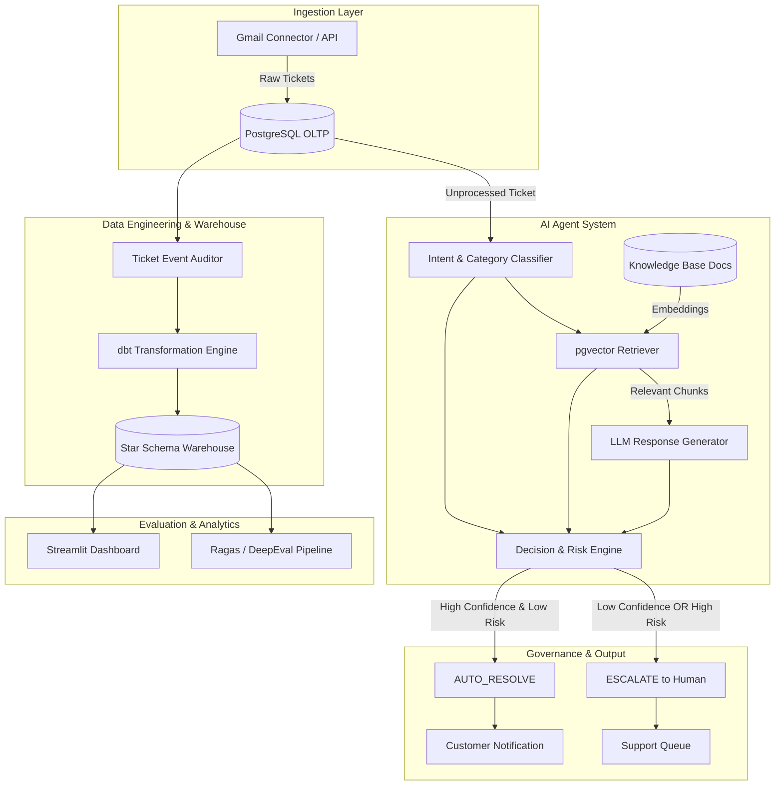

# ResolveAI — Support Ticket Triage & Auto-Resolution Agent

> An enterprise-grade, joint Data Engineering and AI Engineering platform for automated customer support triage, grounded RAG response generation, deterministic decision engine governance, and continuous model performance evaluation.

---

## 1. What is ResolveAI?

**ResolveAI** is an AI-powered customer support automation platform designed to ingest incoming support tickets, classify their category, intent, and priority, perform vector search over policy documents using RAG, generate grounded responses, assess risk/confidence, and decide whether to **auto-resolve** the ticket or **escalate** it to a human support agent.

Unlike naive chatbots, ResolveAI treats ticket lifecycle management and operational tracking as first-class citizens. Every ticket event, AI prediction, knowledge retrieval chunk, decision threshold, human intervention, and resolution state is stored in a structured analytical data warehouse for evaluation and auditability.

---

## 2. The Problem

Modern customer support teams face high ticket volumes, long resolution times, inconsistent response quality, and high operational costs. Naive chatbot integrations often fail in production because:
- They lack deterministic risk governance, leading to **false auto-resolutions** (hallucinated policy answers that frustrate users).
- They operate as black-box tools with no structured data layer tracking AI predictions vs. actual human outcomes.
- They lack proper evaluations (RAG groundedness, retrieval precision, intent accuracy).

**ResolveAI** solves this by combining a robust **Data Engineering Warehouse** (PostgreSQL + pgvector + dbt) with a **Provider-Agnostic AI Agent** governed by a strict **Risk-Aware Decision Engine**.

---

## 3. How the System Works

1. **Ingestion**: Raw support tickets are ingested via connectors (e.g., Gmail API) into raw landing tables.
2. **Data Transformation & Eventing**: Tickets undergo state transition auditing (`NEW` -> `CLASSIFIED` -> `RETRIEVED` -> `RESPONSE_GENERATED` -> `DECISION_PENDING`).
3. **AI Classification**: Multi-task classification determines intent, category, and priority.
4. **Knowledge Retrieval (RAG)**: Relevant company knowledge chunks are extracted from PostgreSQL vector storage (`pgvector`).
5. **Grounded Generation**: LLM generates a response constrained strictly to retrieved context.
6. **Decision Engine**: Evaluates confidence, retrieval relevance score, customer tier, and risk profile. Emits `AUTO_RESOLVE` or `ESCALATE`.
7. **Resolution & Feedback**: Resolves ticket automatically or routes to human agent. Records final resolution for dbt analytics and evaluation.

---

## 4. Architecture Diagram



---

## 5. Data Engineering Layer

The data layer is built on PostgreSQL 16 with `pgvector` for transactional vector operations, transformed via `dbt Core` into dimensional star-schema models.

### Key Entities
- **OLTP Tables**: `customers`, `products`, `tickets`, `ticket_messages`, `ticket_events`, `ai_predictions`, `resolutions`, `escalations`, `knowledge_documents`, `knowledge_chunks`.
- **Dimensional Marts**:
  - `dim_customer`, `dim_product`, `dim_category`
  - `fact_ticket`, `fact_ticket_message`, `fact_ticket_event`, `fact_ai_prediction`, `fact_resolution`, `fact_escalation`

Every AI prediction stores complete audit lineage: `ticket_id`, `predicted_category`, `predicted_intent`, `predicted_priority`, `confidence_score`, `retrieval_quality`, `generated_response`, `decision`, `model_version`, `prompt_version`, `created_at`.

---

## 6. AI System Architecture & Provider Abstraction

ResolveAI implements a clean provider abstraction pattern (`LLMProvider`) preventing vendor lock-in:

- **Primary Provider**: Google Gemini API (`google-genai` SDK using `gemini-2.5-flash`).
- **Fallback Provider**: OpenRouter API (`anthropic/claude-3.5-sonnet`, `meta-llama/...`).

---

## 7. Retrieval-Augmented Generation (RAG)

Knowledge documents (`knowledge_base/documents/*.md`) are chunked, embedded, and stored in PostgreSQL using `pgvector`.
- Similarity search uses cosine distance (`<=>` operator in pgvector).
- Strict prompt templates forbid hallucinating policies outside the retrieved chunks.
- Retrieved document/chunk references are persisted directly with the `ai_predictions` database record.

---

## 8. Decision Engine Governance

The system does **NOT** blindly auto-resolve tickets. A dedicated rule and risk engine evaluates:
- Model prediction confidence score ($\ge 0.85$)
- Vector retrieval relevance score ($\ge 0.80$)
- Issue Category (e.g., General Inquiry vs. Billing/Refund)
- Issue Severity & Customer Tier
- Historical auto-resolution accuracy for the predicted category

**Decision Rules**:
$$\text{Decision} = \begin{cases} \text{AUTO\_RESOLVE} & \text{if } \text{Confidence} \ge \tau_c \land \text{Retrieval} \ge \tau_r \land \text{Risk} = \text{Low} \\ \text{ESCALATE} & \text{otherwise} \end{cases}$$

---

## 9. Evaluation Methodology

Evaluation is a first-class citizen in ResolveAI, focusing on 4 pillars:
1. **Classification**: Category, Intent, Priority accuracy.
2. **Retrieval**: Context recall and precision.
3. **Response**: Groundedness, answer correctness.
4. **Operational & Safety**: Escalation rate, average handling time, and the primary safety metric:
   $$\text{False Auto-Resolution Rate} = \frac{\text{Incorrectly Auto-Resolved Tickets}}{\text{Total Auto-Resolved Tickets}}$$

---

## 10. Key Business Analytics Metrics

- **Auto-Resolution Rate**: % of total incoming tickets auto-resolved without human intervention.
- **Escalation Rate**: % of tickets routed to human support agents.
- **False Auto-Resolution Rate**: % of auto-resolved tickets requiring follow-up/reopening.
- **First Response Time (FRT)**: Time from ticket ingestion to initial auto/human response.
- **Human Hours Saved**: Estimated support staff hours saved by auto-resolution.

---

## 11. Technology Stack

- **Data Engineering**: Python 3.12+, PostgreSQL 16, `pgvector`, `dbt Core`, Apache Airflow, Pandas.
- **AI / LLM**: Gemini API (`google-genai`), OpenRouter API fallback, RAG vector retrieval.
- **Backend Service**: FastAPI, Pydantic v2, Uvicorn.
- **Analytics & Dashboard**: Streamlit.
- **Testing & Tooling**: Pytest, Ruff, Docker Compose, Make.

---

## 12. Repository Structure

```text
ResolveAI/
├── README.md                  # Main documentation & architecture guide
├── LICENSE                    # MIT License
├── .gitignore                 # Exclusion rules
├── .env.example               # Environment variables template
├── Dockerfile                 # Container image specification
├── docker-compose.yml         # Container orchestration (Postgres, API, Dashboard)
├── Makefile                   # Automation shortcuts
├── pyproject.toml             # Python dependencies & build config
│
├── docs/                      # Technical documentation
│   ├── architecture.md
│   ├── data-model.md
│   ├── ai-system.md
│   ├── evaluation.md
│   └── development.md
│
├── ingestion/                 # Connector abstraction layer
│   ├── README.md
│   └── src/ (base.py, gmail.py)
│
├── warehouse/                 # Database DDL & migration scripts
│   ├── README.md
│   └── schema.sql
│
├── dbt/                       # Analytical transformation models
│   ├── dbt_project.yml
│   ├── profiles.yml.example
│   ├── models/ (staging/, intermediate/, marts/)
│   └── schema.yml files
│
├── features/                  # Feature engineering module
│   └── README.md
│
├── agent/                     # Core AI Agent system
│   ├── README.md
│   └── src/ (llm/, classification/, retrieval/, generation/, decision/, prompts/)
│
├── knowledge_base/            # Source documents & markdown repository
│   ├── README.md
│   └── documents/ (*.md)
│
├── evaluation/                # Model evaluation harness
│   ├── README.md
│   ├── datasets/ (sample_golden_set.json)
│   └── src/ (metrics.py, evaluator.py)
│
├── api/                       # REST API Backend
│   ├── README.md
│   └── src/ (main.py, config.py, schemas.py)
│
├── dashboard/                 # Streamlit operational dashboard
│   ├── README.md
│   └── src/ (app.py)
│
├── airflow/                   # Pipeline orchestration
│   ├── README.md
│   └── dags/ (ticket_processing_dag.py)
│
├── tests/                     # Automated unit and integration tests
│   └── unit/ (test_decision_engine.py, test_llm_provider.py, test_api.py)
│
└── scripts/                   # Helper utilities
    ├── init_db.py
    └── seed_knowledge.py
```

---

## 13. Local Setup Guide

### Prerequisites
- Python 3.12+
- Docker & Docker Compose
- Git

### Quickstart

1. **Clone repository & prepare environment variables**:
   ```bash
   cp .env.example .env
   ```

2. **Initialize Python virtual environment**:
   ```bash
   python3 -m venv .venv
   source .venv/bin/activate
   make init
   ```

3. **Start PostgreSQL with pgvector**:
   ```bash
   make docker-up
   ```

4. **Seed Knowledge Base & Vector Store**:
   ```bash
   make seed-kb
   ```

5. **Run FastAPI Backend**:
   ```bash
   make dev
   ```
   Access API documentation at `http://localhost:8000/docs`.

6. **Run Streamlit Dashboard**:
   ```bash
   make dashboard
   ```
   Access dashboard at `http://localhost:8501`.

7. **Run Unit Tests**:
   ```bash
   make test
   ```

---

## 14. Status Breakdown

| Feature / Component | Status | Description |
| :--- | :---: | :--- |
| Project Monorepo Structure | **Implemented** | Full modular architecture and directories. |
| Docker Compose Setup | **Implemented** | Postgres + pgvector, API, Dashboard setup. |
| Warehouse OLTP Schema | **Implemented** | Full PostgreSQL DDL (`schema.sql`). |
| dbt Star Schema Models | **Implemented** | Staging, intermediate, and marts models. |
| LLM Provider Abstraction | **Implemented** | Base interface with Gemini & OpenRouter adapters. |
| Risk-Aware Decision Engine | **Implemented** | Deterministic auto-resolution governance. |
| Evaluation Metrics Harness | **Implemented** | Safety metrics including False Auto-Resolution Rate. |
| Ingestion Interface | **Implemented** | `TicketSource` base class & Gmail connector stub. |
| FastAPI REST Endpoints | **Implemented** | Health, ticket ingestion, and prediction status APIs. |
| Streamlit Dashboard | **Implemented** | Operational metrics & escalation UI foundation. |
| Live Gmail OAuth Sync | *Planned* | Full OAuth2 authentication workflow. |
| Production Airflow Celery | *Future* | Multi-worker distributed execution setup. |

---

## 15. License

Licensed under the [MIT License](LICENSE).
